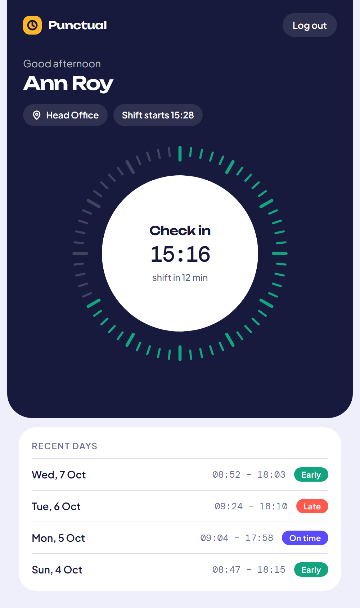
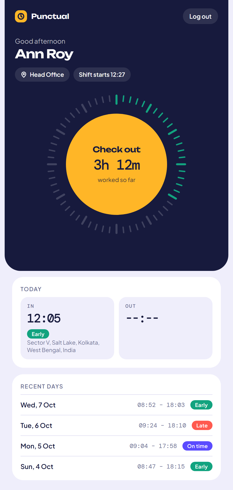
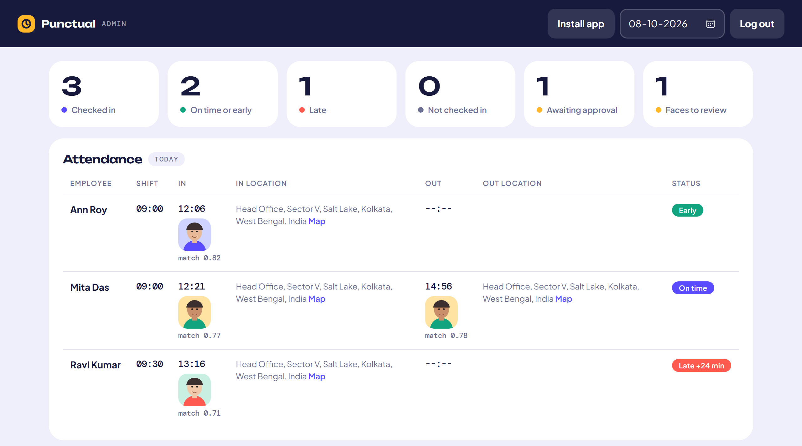

# Punctual

Location- and face-verified employee attendance. Employees check in and out from their phone or PC; the app confirms they are at the office and that it is really them, records where and when, and tells them whether they are early, on time or late. Admins see everything live on a dashboard.

Both screens are installable as apps (PWA) with their own icons: **Punctual** for employees, **Punctual Admin** for admins.

| Employee (phone) | Employee, checked in | Admin dashboard |
|---|---|---|
|  |  |  |

> Screenshots use made-up demo data.

## Features

**Employee**
- Sign up with a selfie, log in, then check in and out with one tap on a watch-face dial
- Live GPS fix, reverse-geocoded to a street address with OpenStreetMap
- Instant feedback: "You're early by 8 min, good job!" / "You're 24 min late, try better tomorrow!"
- Today's card (time and address for check-in and check-out) and the last 10 days
- Check-in and check-out only work inside the office circle, with a usable GPS fix, and with a selfie that matches the approved face

**Admin**
- Daily attendance table: who, when, where, selfie, match score, early/on time/late, with a date picker
- Live updates and pop-up alerts when someone signs up, registers a face, checks in or out
- Approve or disable employees, review and approve faces (with a warning when the same face is already on another account), set each person's shift start time, see late count and days present for the month
- Office setup on a map: drag the pin or use your current location, resize the attendance circle (20 m to 1 km), set the late grace period, working days and holidays

## Tech stack

| Layer | Choice |
|---|---|
| Backend | Python, FastAPI, REST API |
| Database | MySQL (`schema.sql`) via PyMySQL, one connection per thread |
| Auth | JWT in an HttpOnly (and, over HTTPS, Secure) cookie, admin / employee roles, scrypt password hashes, database-backed rate limits, cross-site write blocking |
| Frontend | Plain HTML, CSS and JavaScript, Leaflet maps (no build step) |
| Location | Browser Geolocation API, OpenStreetMap Nominatim for addresses (can be switched off) |
| Face check | OpenCV (YuNet face detector + SFace recogniser, small ONNX models with pinned checksums), camera via `getUserMedia` |
| Install | PWA: web manifests, service worker, separate icons for the two apps |
| Tests | pytest unit tests and a full end-to-end script, both run by GitHub Actions |

## How it works

- **Geofence:** the server measures the distance between the employee's position and the office point (haversine formula) and rejects check-in **and** check-out outside the admin's radius. It fails closed: nobody can check in until an office is saved. GPS fixes worse than `MAX_ACCURACY` metres are refused.
- **Early, on time, late:** compared with the employee's own shift start plus the admin's grace period, in the server's local time.
- **One record per employee per day:** enforced by a unique key in the database; a double tap returns a clean "already checked in", not an error.
- **Approvals:** self-registered accounts stay pending until an admin approves them. Admins cannot mark attendance.
- **Face check:** the sign-up selfie is turned into a 128-number face signature and waits for admin approval. After that every check-in and check-out selfie is compared with it (cosine similarity, threshold 0.363) and rejected if it does not match. The score and the selfie are saved so the admin can review them.
- **Working days:** "not checked in" only counts on working days that are not listed holidays.
- **Addresses** are looked up on the server after the response is sent, cached, and rate-limited to Nominatim's one request per second.

## Run it locally

Requires Python 3.12+ and MySQL (or MariaDB). The first start downloads the two face models (about 39 MB) into `models/` and checks their SHA-256.

```bash
# 1. create the database and tables
mysql -u root -p < schema.sql          # or run schema.sql in HeidiSQL / phpMyAdmin

# 2. install dependencies
pip install -r requirements.txt

# 3. start the app (PowerShell shown; use export on macOS/Linux)
$env:MYSQL_USER="root"; $env:MYSQL_PASSWORD="your-mysql-password"; $env:ADMIN_PASSWORD="choose-a-strong-password"; python main.py
```

Open `http://localhost:3000/admin` and log in as `admin`. The app **refuses to start the first time without an `ADMIN_PASSWORD` of 8+ characters**; there is no default password. On Windows, `start.ps1` asks for the passwords and also opens a public tunnel link for phones.

| Variable | Default | Purpose |
|---|---|---|
| `MYSQL_HOST` / `MYSQL_PORT` | `127.0.0.1` / `3306` | Database server |
| `MYSQL_USER` / `MYSQL_PASSWORD` | `root` / empty | Database login |
| `MYSQL_DB` | `attendance` | Database name |
| `ADMIN_PASSWORD` | none | Creates the `admin` account on the first start only (8+ characters) |
| `MAX_ACCURACY` | `150` | Worst GPS accuracy, in metres, still accepted. A laptop on Wi-Fi is often worse than this, so use a phone |
| `PHOTO_RETENTION_DAYS` | `90` | Attendance selfies older than this are deleted automatically |
| `GEOCODE` | `on` | `off` stops employee coordinates being sent to OpenStreetMap |
| `NOMINATIM_CONTACT` | none | Optional contact (email or URL) added to the address-lookup User-Agent, as Nominatim asks |
| `PORT` | `3000` | Web port |

### Try it on a phone

Phones only allow location and camera access on HTTPS. For a quick demo, expose your local app with a free tunnel:

```bash
cloudflared tunnel --protocol http2 --url http://localhost:3000
```

Open the `https://…trycloudflare.com` address it prints on your phone, then use the browser's **Install app** option to add the icon to the home screen. Free quick tunnels hold back the live-update stream, so the admin page switches to checking every 4 seconds there.

## Tests

```bash
pip install -r requirements-dev.txt
pytest -q                                                   # unit tests, no database needed
python tests/e2e.py http://127.0.0.1:3000 <ADMIN_PASSWORD>  # full flow against a running app and an empty database
```

GitHub Actions runs both on every push (`.github/workflows/ci.yml`): the unit tests, and the end-to-end script against a real MySQL service. The end-to-end script covers sign-up, approval, geofence, GPS accuracy, wrong-face rejection, early/on-time/late, check-out, working days, rate limits, CSRF and the secure cookie.

## Privacy and security

- **Biometric and location data.** The app stores a face signature, selfies and employee coordinates. Selfies are encrypted on disk (the key lives in the database), attendance selfies are deleted after `PHOTO_RETENTION_DAYS`, orphaned files are swept, and the admin can delete a person's face data at any time ("Reset"). Employees are told what is stored before the camera opens.
- **Third party.** Coordinates go to OpenStreetMap's Nominatim to get an address unless `GEOCODE=off`.
- **Legal.** If you use this for real employees, get advice on your data-protection duties (for example India's DPDP Act 2023). This README is not legal advice.
- **Passwords:** 8+ characters, scrypt (cost 2^15). Older hashes are upgraded at the next login.
- **Sessions:** HttpOnly cookie, `Secure` whenever the request arrives over HTTPS (including behind a tunnel), 7-day JWT. Writes with a foreign `Origin` are rejected.
- **Rate limits** (stored in the database, so they survive restarts): 10 wrong passwords per username and IP, 40 per IP, 20 sign-ups per IP per hour, and at most 200 accounts waiting for approval. The client IP comes from the tunnel's header only when the request arrives from this machine.

## Project structure

```
main.py              API, auth, geofence and attendance logic
schema.sql           MySQL tables
employee.html        Employee app
admin.html           Admin app
static/              PWA manifests, icons, service worker
tests/               unit tests and the end-to-end script
.github/workflows/   CI
start.ps1            Windows helper: starts the app and a tunnel
models/              face models (downloaded on first start, not committed)
photos/              selfies (created at runtime, not committed)
docs/                README screenshots
```

## Known limits

- **The phone is trusted for location, photo and accuracy.** A rooted phone or a modified browser can fake all three. The server's defences are the geofence, the accuracy limit, face matching and the admin's approval; none can prove the camera is live.
- **No liveness check yet.** A photo or video of the right person held up to the camera can pass the face match. The admin's review of the stored selfies and scores is the backstop.
- **The sign-up selfie is only as good as the admin's check** that the photo belongs to the right person; the duplicate-face warning helps with one person on two accounts.
- Times are judged in the server's time zone, so this suits a single office.
- No password reset, CSV export, leave management or per-shift geofences yet.

## License

MIT, see [LICENSE](LICENSE).
